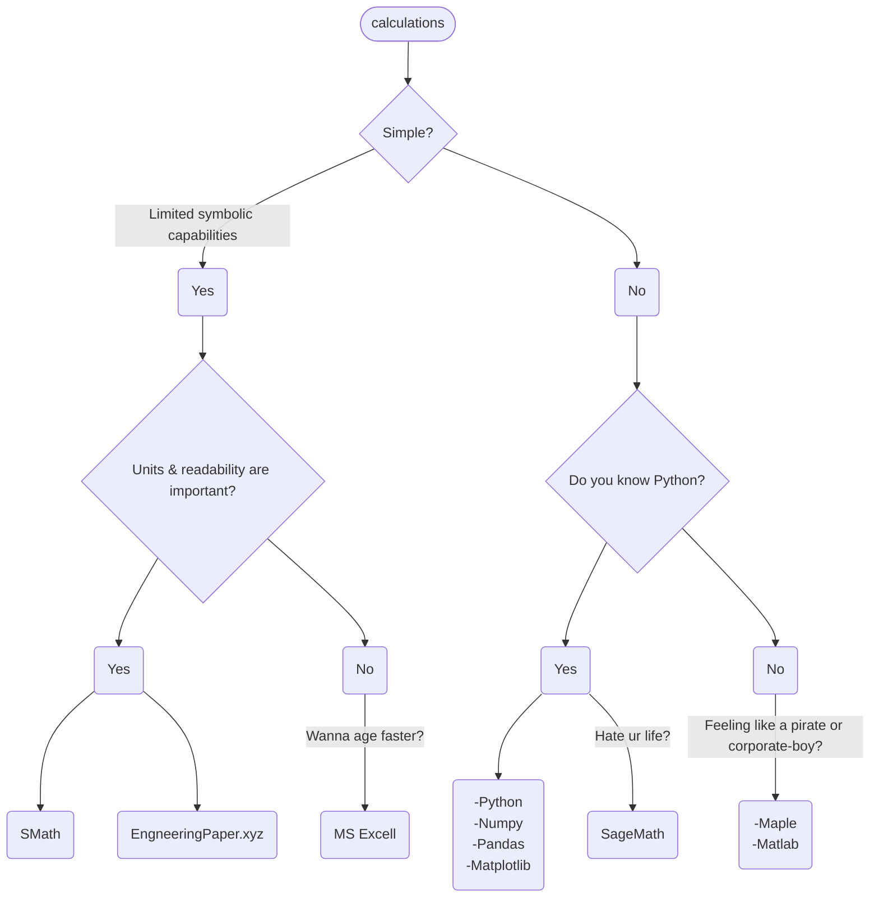

```mermaid

flowchart TD
  node_1(["calculations"])
  node_2{"Simple?"}
  node_3("Yes")
  node_4("No")
  node_5{"Units #amp; readability are important?"}
  node_7("Yes")
  node_8("SMath")
  node_9("No")
  node_10("MS Excell")
  node_6{"Do you know Python?"}
  node_11("Yes")
  node_12("No")
  node_13("-Python
  -Numpy
  -Pandas
  -Matplotlib ")
  node_14("SageMath")
  node_15("EngneeringPaper.xyz")
  node_16("-Maple
  -Matlab
")
 

  node_1 --> node_2
  node_2 --"Limited symbolic capabilities"--> node_3
  node_2 --> node_4
  node_3 --> node_5
  node_5 --> node_7
  node_7 --> node_8
  node_5 --> node_9
  node_9 --"Wanna age faster?"--> node_10
  node_4 --> node_6
  node_6 --> node_11
  node_6 --> node_12
  node_11 --> node_13
  node_11 --"Hate ur life?"--> node_14
  node_7 --> node_15
  node_12 --"Feeling like a pirate or corporate-boy?"--> node_16

```