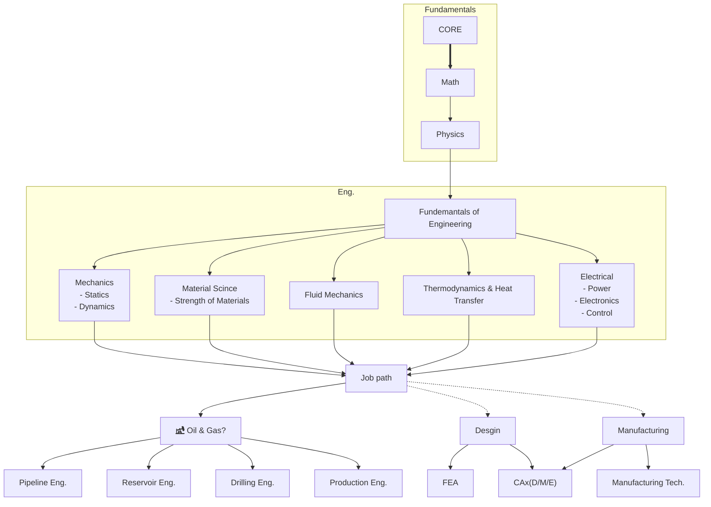

# The Mechanical Engineering Hub

Opinionated list of things I wish I knew when I started my journey in Mechanical Engineering. This is a living document and will be updated as I learn more. If you have any suggestions, feel free to open an issue.

## Table of Contents

1. [The Mechanical Engineering Hub](#the-mechanical-engineering-hub)
   1. [Table of Contents](#table-of-contents)
   2. [Introductory General Readings ↫](#introductory-general-readings-)
   3. [Introductory reading for math and physics ↫](#introductory-reading-for-math-and-physics-)
   4. [Textbook \& Research Papers Resources ↫](#textbook--research-papers-resources-)
   5. [Stuff worth checking out ↫](#stuff-worth-checking-out-)
   6. [Essential Tools ↫](#essential-tools-)
      1. [PDF readers](#pdf-readers)
      2. [Calculations and graphing](#calculations-and-graphing)
      3. [Note Taking \& Programming](#note-taking--programming)

## Introductory General Readings [↫](#table-of-contents)

1. [How to read a book](https://fs.blog/how-to-read-a-book/)
2. [How to read a research paper](http://ccr.sigcomm.org/online/files/p83-keshavA.pdf)
3. [How complex systems fail](https://how.complexsystems.fail/)

## Introductory reading for math and physics [↫](#table-of-contents)

1. [The Feynman Lectures on Physics](https://www.feynmanlectures.caltech.edu/)
2. [Calculus Made Easy](https://calculusmadeeasy.org/)

## Textbook & Research Papers Resources [↫](#table-of-contents)

1. [Library Genesis](https://libgen.is/) - The zenth of all online libraries. You can find almost any book here.[^1]
2. [Sci-Hub](https://sci-hub.se/) - This is a website that has a lot of scientific papers that you can download for free. It is a great resource for finding papers that you can't find anywhere else.[^2]
   1. [Sci-Hub X Now!](https://github.com/gchenfc/sci-hub-now) - Free access to academic papers with just a single click in the broswer.
   2. [Zotero Scihub](https://github.com/ethanwillis/zotero-scihub) - Addon for Zotero and Juris-M to automatically download PDFs from Sci-Hub.
3. [Open Source Mechanical Engineering Books](https://www.intechopen.com/subjects/121)
4. [Free Computer Books](https://freecomputerbooks.com/)
>[!NOTE]
>If the link is donw, search for the domain using duckduckgo.

[^1]: [Mirrors for GenLib](https://libgen.onl/library-genesis/) - If the main website is down, you can use one of the mirrors to access the website.
[^2]: [Mirror for SciHub](https://sci-hub.hkvisa.net/)

## Stuff worth checking out [↫](#table-of-contents)

1. [Bartosz Ciechanowski](https://ciechanow.ski/archives/) - Explores intreating topics with interactive visualizations.`Blog`
2. [Willem Pennings](https://willempennings.nl/) - Inspiring projects.
3. [The Efficient Engineer)](https://www.youtube.com/@TheEfficientEngineer) - Explores fundamental engineering concepts with animation.`YouTube`

## Essential Tools [↫](#table-of-contents)

### PDF readers

1. [Sioyek](https://sioyek.info/) - A PDF reader that is designed for reading scientific papers. It has a lot of features that make it easier to read scientific papers. An overview tutorial of the features and capabilities can be found [here](https://www.youtube.com/watch?v=RaHRvnb0dY8&t=1506s).
2. [Samarta PDF](https://www.sumatrapdfreader.org/free-pdf-reader.html) - A free PDF reader that is designed for reading scientific papers. It has a lot of features that make it easier to read scientific papers.

### Calculations and graphing
1. [Smath Studio](https://smath.com/en-US) - A free software that you can use to solve equations.`Standalone`
2. [Engineering paper](https://engineeringpaper.xyz/) - Shareable interactive engineering calculations and graphs powered by Python.`Online`
3. [Fxsolver](https://www.fxsolver.com/) - Huge library of equations and formulas covering all felids of science and engineering.`Online`
4. [Desmos](https://www.desmos.com/) - Online graphing calculator.`Online`
<!-- 5. [NumPad](https://numpad.io/) - Online calculator with units and constants.`Online` -->

### Note Taking & Programming 

1. [VScode](https://code.visualstudio.com/) - A code editor that is designed for programming. It has a lot of features that make it easier to program.`Standalone & Online`
 
2. [Obsidian](https://obsidian.md/) - A note-taking app that is designed for taking notes. It has a lot of features that make it easier to take notes.`Standalone`

<!-- ~~~~~~~~~~~~~~~~~~~~~~~~~~~~~~~~~~~~~~~~~~~~~~~~~~~~~~~~~~~~~~~~~~~~~~~~~~~~~~~~~~~~~~~ -->
<!-- ## Recommended books for Mechanical Engineering [↫](#table-of-contents) [^3]
[^3]: use [Library Genesis](#online-resources-%E2%86%ABtable-of-contents) to download the books.
### Introduction

1. An Introduction to Mechanical Engineering by Jonathan Wickert
Fundamentals

### Engineering Mechanics [↫](#table-of-contents)

#### Statics

1. Engineering Mechanics: Statics by Hibbeler
2. Engineering Mechanics: Statics by Meriam and Kraige (supplement)
3. Mechanics (Dover Books on Physics) by Hartog (Also covers basic dynamics)

#### Dynamics

1. Engineering Mechanics: Dynamics by Hibbeler
5. Engineering Dynamics: A Comprehensive introduction by Kasdin and Paley
6. Fundamentals of Applied Dynamics by Williams Jr

### Mechanics of Materials [↫](#table-of-contents)

1. Mechanics of Materials by Hibbeler
2. Mechanics of Materials by Gere and Goodno (or the older editions by Gere and Timoshenko)
3. Mechanics of Materials by Popov
4. Strength of Materials (Dover Books on Physics) by Den Hartog
5. Advanced Strength of Materials (Dover Civil and Mechanical Engineering) by Den Hartog
6. History of Strength of Materials by Timoshenko (Interesting read to go along with the above)

### Material Science [↫]#table-of-contents)

1. Fundamentals of Materials Science and Engineering - Callister and Rethwisch (Crystallography)
2. Mechanical Behavior of Materials - Dowling (Excellent resource on material failure)
3. The New Science of Strong Materials or Why You Don't Fall through the Floor - Gordon

### Fluid Mechanics [↫](#introduction)

1. Fluid Mechanics: Fundamentals and Applications by Çengel and Cimbala
2. Fluid Mechanics by Kundu and Cohen

### Thermodynamics [↫](#introduction)

1. Thermodynamics: An Engineering Approach by Çengel and Boles
2. Fundamentals of Engineering Thermodynamics by Moran, Shapiro, Boettner, and Bailey
3. Fundamentals of Thermodynamics by Borgnakke and Sonntag

### Mechanical Design [↫](#introduction)

1. Fundamentals of Machine Component Design by Juvinall and Marshek
2. Materials Selection in Mechanical Design by Ashby
3. Shigley's Mechanical Engineering Design by Budynas and Nisbett
4. Machine Design: An Integrated Approach by Norton
5. DANotes: Design and Analysis of Machine Elements by Douglas Wright
6. Machine Elements in Mechanical Design by Mott, Vavrek and Wang

### Heat Transfer [↫](#introduction)

1. Heat and Mass Transfer: Fundamentals and Applications by Çengel and Ghajar
2. Fundamentals of Heat and Mass Transfer (or introduction to Heat Transfer) by Incropera, DeWitt, Bergman, and Lavine
3. A Heat Transfer Textbook (Dover Civil and Mechanical Engineering) by John H Lienhard V and John H Lienhard IV

### Special Topics [↫](#introduction)

#### Vibrations

1. Engineering Vibration by Inman
2. Mechanical Vibration: Analysis, Uncertainties, and Control by Benaroya
3. Mechanical Vibrations by Rao
4. Fundamentals of Vibrations by Meirovitch
5. Mechanical Vibrations by Den Hartog (Dover Civil and Mechanical Engineering)
Special Topics

#### Manufacturing

1. Fundamentals of Modern Manufacturing: Materials, Processes, and Systems by Groover
Manufacturing Processes for Engineering Materials by Kalpakjian and Schmid
DeGarmo’s Materials and Processes in Manufacturing by Black and Kohser
Aerodynamics
1. Fundamentals of Aerodynamics by Anderson
2. Foundations of Aerodynamics: Bases of Aerodynamic Design by Kuethe and Chow

#### Computational Fluid Dynamics

1. Computational Fluid Dynamics: The Basics with Applications by Anderson
2. Computational Fluid Mechanics and Heat Transfer by Pletcher, Tannehill and Anderson

#### Orbital Mechanics

1. Fundamentals of Astrodynamics (Dover Books on Aeronautical Engineering) by Bate, Mueller, and White (Classic from 1971)
1. Orbital Mechanics for Engineering Students by Curtis
1. Fundamentals of Astrodynamics and Applications by Vallado
2. An introduction to the Mathematics and Methods of Astrodynamics by Battin
Space System Design
1. Spacecraft Systems Engineering by Fortescue, Stark, and Swinerd
2. Space Vehicle Design by Griffin and French
3. Space Mission Engineering: The New Space Mission Analysis and Design by Wertz, Everett, and Puschell
4. The Space Environment: Implications for Spacecraft Design by Tribble

#### Propulsion

1. Mechanics and Thermodynamics of Propulsion by Hill and Peterson
2. Rocket Propulsion Elements by Sutton and Biblarz
3. Modern Engineering for Design of Liquid Propellant Rocket Engines by Huzel and Huang
4. Blazing the Trail: The Early History of Spacecraft and Rocketry by Gruntman (Interesting and well written text to go with the above)

#### Flight Mechanics

1. Mechanics of Flight by Phillips
2. Aircraft Flight Dynamics by Stengel
3. Airplane Stability and Control: A History of the Technologies that Made Aviation Possible by Abzug and Larrabee

#### Aircraft Design

1. Aircraft Design: A Conceptual Approach by Raymer
2. Aircraft Structures for Engineering Students by Megson
3. Aircraft Structures (Dover Books on Aeronautical Engineering) by Peery
4. Analysis and Design of Flight Vehicle Structures by Bruhn
5. Airframe Structural Design: Practical Design Information and Data on Aircraft Structures by Niu
6. Compressible Fluid Mechanics
7. Modern Compressible Flow: With Historical Perspective by Anderson
8. introduction to Compressible Fluid Flow by Oosthuizen and Carscallen
9. Elements of Gasdynamics (Dover) by Liepmann and Roshko

#### Internal Combustion Engine

1. Engineering Fundamentals of the Internal Combustion Engine by Pulkrabek
2. Internal Combustion Engine Fundamentals by Heywood

#### Combustion Theory

1. An Introduction to Combustion: Concepts and Applications by Turns
2. Principles of Combustion by Kuo
3. Combustion by Glassman, Yetter, and Glumac
4. Combustion Theory by Williams

#### Control Systems Engineering

1. Modern Control Engineering by Ogata
2. Control Systems Engineering by Nise
3. Modern Control Theory by Brogan
4. Multivariable Feedback Control: Analysis and Design by Skogestad and Postlethwaite
5. Optimal Control Theory: An Introduction (Dover Books on Electrical Engineering) by Kirk
6. A Course in Robust Control Theory: A Convex Approach by Dullerud and Paganini

#### Advanced Dynamics

1. Intermediate Dynamics for Engineers: A Unified Treatment of Newton-Euler and Lagrangian Mechanics by O'Reilly
2. Classical Dynamics (Dover Books) by Greenwood
3. Advanced Dynamics by Greenwood
Tensor Calculus and Analytical Dynamics by Papastavridis
4. Analytical Mechanics: A Comprehensive Treatise on the Dynamics of Constrained Systems by Papastavridis

#### Analytical Mechanics

1. Goldstein - Classical Mechanics
2. Scheck - Mechanics
3. Corben and Stehle - Classical Mechanics (Dover Books on Physics)
4. Arnold - Mathematical Methods of Classical Mechanics
5. Abraham and Marsden - Foundations of Mechanics (very advanced)
6. Whittaker - A Treatise on the Analytical Dynamics of Particles and Rigid Bodies (Classic reference)

#### Acoustics

1. Fundamentals of Engineering Acoustics by Kinsler
2. Acoustics by Beranek -->
