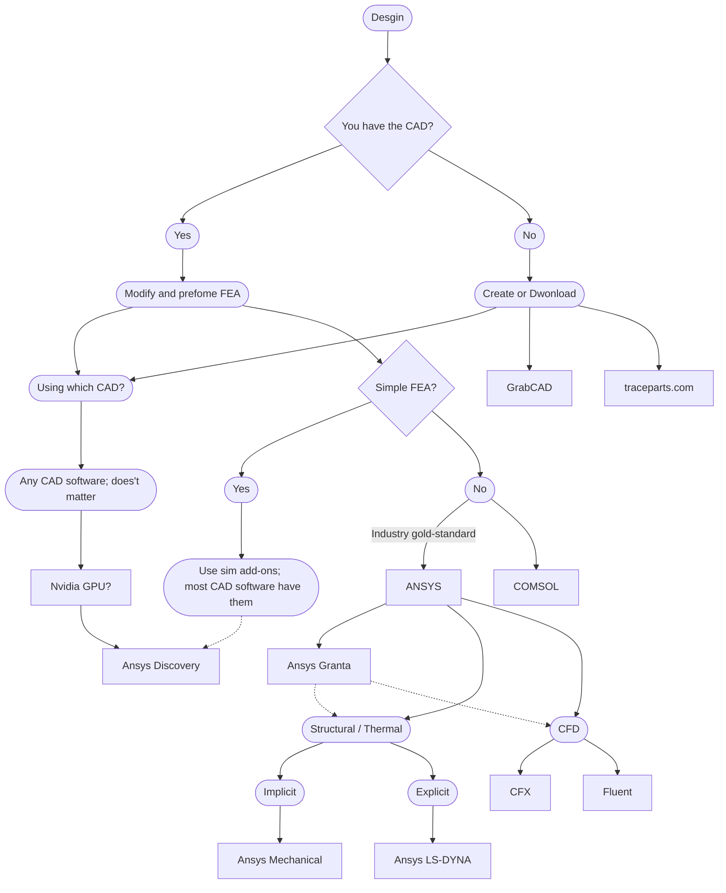

```mermaid

flowchart TD
  node_1(["Desgin"])
  node_2{"You have the CAD?"}
  node_3(["Yes"])
  node_4(["No"])
  node_5(["Modify and prefome FEA"])
  node_6(["Using which CAD?"])
  node_7(["Any CAD software; does#39;t matter"])
  node_8{"Simple FEA?"}
  node_9(["Yes"])
  node_10(["No"])
  node_11(["Use sim add-ons; 
  most CAD software have them"])
  node_12["ANSYS"]
  node_13["COMSOL"]
  node_14["Ansys Granta"]
  node_16(["Structural / Thermal"])
  node_15(["Create or Dwonload"])
  node_17(["CFD"])
  node_19["CFX"]
  node_20["Fluent "]
  node_21(["Implicit"])
  node_18["Ansys Mechanical"]
  node_22(["Explicit"])
  node_23["Ansys LS-DYNA"]
  node_24["GrabCAD"]
  node_25["Nvidia GPU?"]
  node_26["Ansys Discovery"]
  node_27["traceparts.com"]
  node_15 --> node_6
  node_1 --> node_2
  node_2 --> node_3
  node_2 --> node_4
  node_3 --> node_5
  node_6 --> node_7
  node_5 --> node_6
  node_5 --> node_8
  node_8 --> node_9
  node_8 --> node_10
  node_9 --> node_11
  node_10 --"Industry gold-standard"--> node_12
  node_10 --> node_13
  node_12 --> node_14
  node_12 --> node_16
  node_4 --> node_15
  node_12 --> node_17
  node_17 --> node_19
  node_17 --> node_20
  node_16 --> node_21
  node_21 --> node_18
  node_16 --> node_22
  node_22 --> node_23
  node_15 --> node_24
  node_14 -.-> node_16
  node_14 -.-> node_17
  node_7 --> node_25
  node_25 --> node_26
  node_11 -.-> node_26
  node_15 --> node_27

```