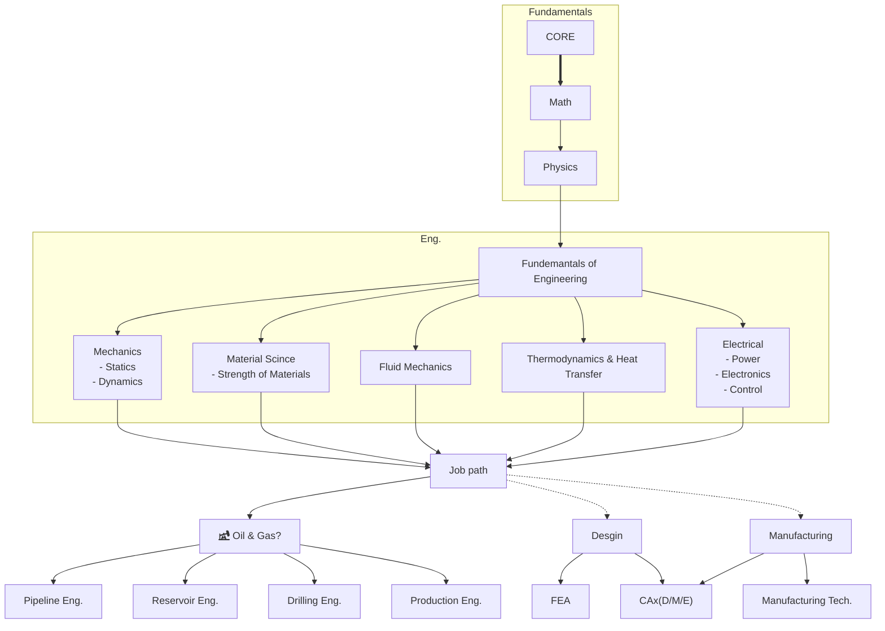

```mermaid

flowchart TB
subgraph Fundamentals
    node_1["CORE"]
    node_2["Math"]
    node_3["Physics"]
end

subgraph Eng.
node_4["Mechanics
- Statics
- Dynamics
"]
node_5["Material Scince
- Strength of Materials"]
node_6["Fluid Mechanics"]
node_7["Fundemantals of Engineering"]
node_8["Thermodynamics & Heat Transfer"]
node_9["Electrical
- Power
- Electronics
- Control"]

end

node_19["Job path"]
node_20["Desgin"]
node_21["FEA"]

node_13["fa:fa-oil-well Oil & Gas?"]
node_22["Pipeline Eng."]
node_23["Reservoir Eng."]
node_24["Drilling Eng."]
node_25["Production Eng."]


node_26["CAx(D/M/E)"]
node_27["Manufacturing Tech."]
node_31["Manufacturing"]

node_1 ==> node_2
node_2 --> node_3
node_3 --> node_7
node_7 --> node_4
node_7 --> node_5
node_7 --> node_6
node_7 --> node_8
node_7 --> node_9 
node_4 --> node_19
node_5 --> node_19
node_6 --> node_19
node_8 --> node_19
node_9 --> node_19
node_19 --> node_13
node_20 --> node_21
node_19 -.-> node_20
node_19 -.-> node_31
node_13 --> node_22
node_13 --> node_23
node_13 --> node_24
node_13 --> node_25
node_20 --> node_26
node_31 --> node_26
node_31 --> node_27


```
